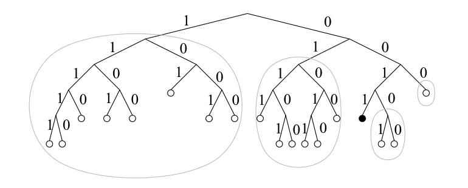
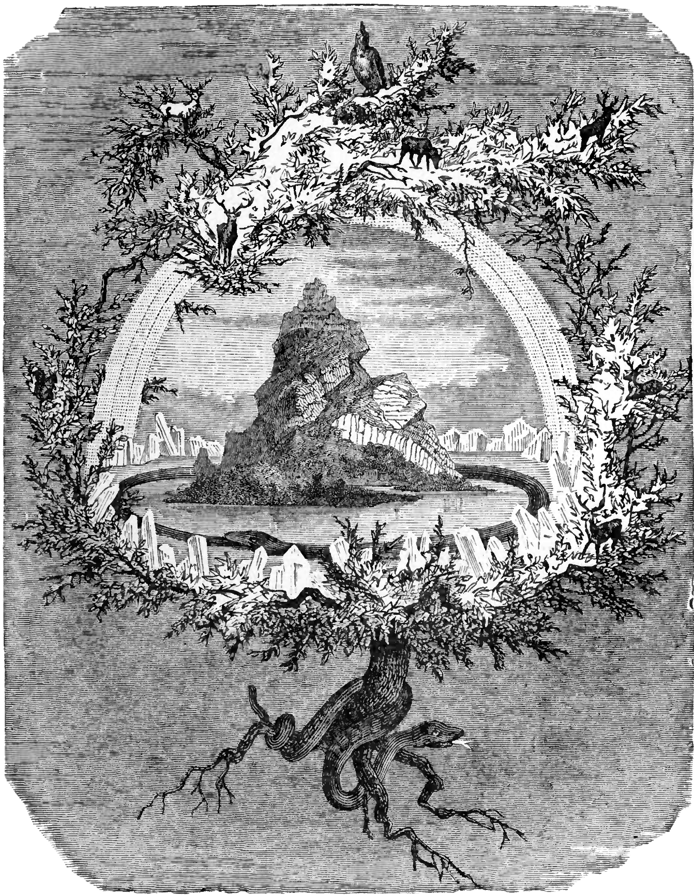

title: Peer-to-Peer Protocols for Our Cyber Commons
class: animation-fade
layout: true

<!-- This slide will serve as the base layout for all your slides -->
.bottom-bar[
  {{title}}
]

---

class: impact

.big[{{title}}]

.small[Benedict Lau // October 2018 @ NUUG]

---

class: long

# Outline

<i class="fas fa-dice-one"></i> **Living with Our Internet**

--

<i class="fas fa-dice-two"></i> **Networks of Our Distributed Web**

--

<i class="fas fa-dice-three"></i> **Protocol Politics of Our Networks**
  - <i class="fas fa-route"></i> **Traffic routing** .em[on distributed non-hierichal networks]
  - <i class="fas fa-sort-alpha-down"></i> **Name assignment** .em[without a trusted global authority]
  - <i class="fas fa-database"></i> **Data aggregation** .em[respecting user privacy and agency]
  - <i class="fas fa-ban"></i> **Content moderation** .em[prioritizing user interests over censoring authorities]
  - <i class="fas fa-users"></i> **Network participation** .em[encouraging inclusive co-creations]
  - <i class="fas fa-hand-holding-usd"></i> **Resource allocation** .em[through collaborative decision making]

--

<i class="fas fa-dice-four"></i> **Fabric of Our Digital Commons**

---

class: impact

.big[<i class="fas fa-dice-one"></i> Living with Our Internet]

---

class: impact

# <i class="fab fa-facebook"></i>

.code[First name]  
.code[Last name]  
.code[Email]  
.code[New password]  

.small[<i class="fas fa-check-square"></i> .code[Agree to our Terms]]

.big[.code[Sign Up]]

---

class: long contain bottom small

background-image: url(assets/facebook-publish.png)

_<i class="far fa-images"></i> https://stratechery.com/2018/the-european-union-versus-the-internet/_

---

class: long

## Referral source of traffic to top web publishers

.center[</img>]

.small[_<i class="far fa-images"></i> https://blog.parse.ly/post/2855/facebook-continues-to-beat-google-in-sending-traffic-to-top-publishers/_]

---

class: long

## Google Accelerated Mobile Pages

.col-6[
<br />

</img>
]

.col-6[
</img>
]

.small[_<i class="far fa-images"></i> https://staltz.com/the-web-began-dying-in-2014-heres-how.html_]  
.small[_<i class="far fa-images"></i> https://developers.googleblog.com/2017/02/whats-in-amp-url.html_]

---

class: impact

.col-6[
.big[<i class="fab fa-google-play"></i>]  

Google Play
]

.col-6[
.big[<i class="fab fa-app-store-ios"></i>]  

Apple Store
]

---

class: impact

.big[
.col-2[<i class="fab fa-whatsapp"></i>]
.col-2[<i class="fab fa-google-drive"></i>]
.col-2[<i class="fab fa-instagram"></i>]
.col-2[<i class="fab fa-apple-pay"></i>]
.col-2[<i class="fab fa-google-wallet"></i>]
.col-2[<i class="fab fa-amazon-pay"></i>]
]

---

class: impact

# <i class="far fa-question-circle"></i> 

.big[Data ownership under surveillance capitalism]

---

class: long contain bottom small

background-image: url(assets/sidewalk-org.png)

_<i class="far fa-images"></i> https://www.cigionline.org/articles/searching-smart-citys-democratic-future_

---

class: long contain bottom small

.background[
.center[
<video width="95%" autoplay muted><source src="assets/sidewalk-toronto.m4v" type="video/mp4"></video>
]
]
_<i class="far fa-images"></i> https://youtu.be/4z0fVAsHFro_

---

class: long contain bottom small

background-image: url(assets/sidewalk-timeline.png)

_<i class="far fa-images"></i> https://www.cigionline.org/articles/searching-smart-citys-democratic-future_

---

class: impact

# <i class="far fa-question-circle"></i> 

.big[Social control with aggregated data]

---

class: long contain bottom small

.background[
.center[
<video width="95%" autoplay muted><source src="assets/censorship.m4v" type="video/mp4"></video>
]
]
_<i class="far fa-images"></i> https://n-o-d-e.net/political_censorship.html_

---

class: long bottom small

background-image: url(assets/censorship-platforms.png)

.em[_<i class="far fa-images"></i> https://n-o-d-e.net/political_censorship.html_]

---

class: impact

# <i class="far fa-question-circle"></i> 

.big[Digital imperialism by high-barrier infrastructure]

---

class: long contain bottom right small

background-image: url(assets/private-fiber.png)

_<i class="far fa-images"></i> https://www.economist.com/business/2017/10/07/tech-giants-are-building-their-own-undersea-fibre-optic-networks_

---

class: long small

.big[Internet users in 2015 as a percentage of a country's population]

.center[</img>]

_<i class="far fa-images"></i> https://en.wikipedia.org/wiki/List_of_countries_by_number_of_Internet_users#/media/File:InternetPenetrationWorldMap.svg_

---

class: impact

.big[<i class="fas fa-dice-two"></i> Networks of Our Distributed Web]

---

# Distributed networks
<i class="fas fa-ellipsis-v"></i> and the protocols that bind them

| <span class="small"><i class="fab fa-connectdevelop"></i></span> | <span class="small">Network</span> | <span class="small"><i class="fas fa-link"></i></span> | <span class="small">Protocol</span> | <span class="small em"><i class="fas fa-info-circle"></i></span> | <span class="small em">Description</span> |
|:--|:--|:--|:--|:--|:--|
| | <span class="alt">Aether</span> | | <span class="alt">c0 + Mim</span> | | <span class="small em">Community-moderated ephemeral boards</span> |
| | Guifi.net | | FONN Compact | | <span class="small em">Catalonia telecommunications network</span> |
| | <span class="alt">Hyperboria</span> | | <span class="alt">cjdns</span> | | <span class="small em">Source-routed encrypted IPv6 network</span> |
| | InterPlanetary File System | | IPFS + libp2p | | <span class="small em">Content-addressed hypermedia protocol</span> |
| | <span class="alt">Scuttleverse</span> | | <span class="alt">Secure Scuttlebutt</span> | | <span class="small em">Social topology-mapped data networks</span> |
| | Yggdrasil Network | | Yggdrasil | | <span class="small em">Greedy-routed encrypted IPv6 network</span> |

<br />

<i class="fas fa-ellipsis-v"></i> among many others

---

class: long

.col-6[
# </img> Guifi.net
</img>
]

.col-6[
### FONN Compact

<i class="fas fa-ellipsis-v"></i> for a free, open, and neutral network

- Establish shared values among community organizations and businesses to create Internet accesss infrastructure in Catalonia

- Facilitate maintainance and expansion of wired, wireless, and fiber network

- Prevent privitization of physical infrastructure while allowing business incentives to sustain a reliable production network
]

.small[_<i class="far fa-images"></i> http://www.ebrecom.com/images/participa.png_]  
.small[_<i class="far fa-images"></i> http://krisdedecker.typepad.com/.a/6a00e0099229e8883301b7c7e2d9d7970b-pi_]

---

class: long

# </img> Guifi.net

## FONN Compact

>- You have the freedom to use the network for any purpose as long as you don't harm the operation of the network itself, the rights of other users, or the principles of neutrality that allow contents and services to flow without deliberate interference.

--

>- You have the right to understand the network and its components, and to share knowledge of its mechanisms and principles.

--

>- You have the right to offer services and content to the network on your own terms.

--

>- You have the right to join the network, and the obligation to extend this set of rights to anyone according to these same terms.

.small[_<i class="far fa-clone"></i> https://guifi.net/en/FONNC_]

---

class: long

.col-6[
# </img> Guifi.net

## Links and routes
</img>
]

.col-6[
- Mix of wired, wireless, and fiber links

- Carrier-grade hardware from vendors like Ubiquiti and MicroTik

- Routing protocol within a community:
  - .alt[BMX6] .small[distance-vector dynamic routing]
  - .alt[OSPF] .small[link-state dynamic routing]

- Backbone network:
  - .alt[BGP] .small[path-vector static routing]

- Maintained and expanded by ISPs and communities bound by FONN Compact
]

.small[_<i class="far fa-images"></i> https://csperkins.org/research/thesis-phd-strowes.pdf_]

---

class: long contain bottom

background-image: url(assets/guifi-mataro.jpg)

.small[_<i class="far fa-images"></i> Mataró, Barcelona_]

---

class: impact

# <i class="far fa-question-circle"></i> 

.big[Centralized components for .hi2[BGP backbone network management] and .hi2[IP address assignment]]

---

class: long

## IPv4 prefixes in Internet BGP forwarding tables
<i class="fas fa-ellipsis-v"></i> stored by every Internet core router

.center[</img>]

.small[_<i class="far fa-images"></i> https://csperkins.org/research/thesis-phd-strowes.pdf_]

---

class: long

## IPv4 prefixes in Internet BGP forwarding tables

.col-6[
### Proportional distribution
</img>
]

.col-6[
### Contribution to address space
</img>
]

.small[_<i class="far fa-images"></i> https://csperkins.org/research/thesis-phd-strowes.pdf_]

---

## Compact routing

<i class="fas fa-ellipsis-v"></i> in comparison to BGP inter-domain routing

- Keep small amounts of routing state at each router, rather than piling all that work onto the core network infrastructure

--

- Without the full network view, a node cannot always determine shortest path  
  .em[<sup>e.g.</sup> Dijkstra's algorithm as in OSPF]

--

- Have routing table grow sublinearly with number of nodes, while getting close to shortest path routing with upper bound

--

- Name-independent schemes that require no pre-processing are suitable for an unmanaged permissionless  network

---

class: impact

# <i class="far fa-question-circle"></i> 

.big[Route traffic in a non-hierchical network with self-addressed flat node IDs]

---

class: long

.col-7[
# <i class="fas fa-directions"></i> Hyperboria

</img>

.small[_<i class="far fa-images"></i> https://www.fc00.org_]
]

.col-5[
### cjdns

- Auto-configure overlay network

- Secure all network traffic with end-to-end encryption:
  - .alt[Curve25519] .small[encryption keys]
  - .alt[Ed25519] .small[signatures]
  - .alt[XSalsa20] .small[stream cipher]
  - .alt[Poly1305] .small[MAC]

- Self-assign IPv6 in `fc00::/8` from cryptographic keys

- Source route with Kademlia-like distributed hash table
]

---

## Self-assignment of IP addresses
<i class="fas fa-ellipsis-v"></i> for permissionless network participation

- Perform two rounds of SHA-512 on .alt[Curve25519 public key] then truncate to derive IPv6 address

- `fc00::/8` address space has 2<sup>120</sup> addresses

--

<br />

### Birthday problem

>1 in 1,329,227,995,784,915,872,903,807,060,280,344,576 chance of generating the same IPv6. Feeling Lucky?

.small[_<i class="far fa-clone"></i> https://github.com/cjdelisle/cjdns/blob/master/doc/notes/arc-workings.md_]

---

.col-8[
## The Kademlia DHT

### Laying out IP addresses

</img>
]

.col-4[
- Node .code[.hi1[0011]] has physical peers to _some_ neighbourhoods 

- Node .code[.hi1[0011]] learns paths to _every_ neighbourhood

- Each node keeps a routing table at each .alt[XOR distance]

- Each node knows its neighbourhood well relative to distant ones
]

.small[_<i class="far fa-images"></i> https://pdos.csail.mit.edu/~petar/papers/maymounkov-kademlia-lncs.pdf_]

---

class: long

.col-7[
### Searching the DHT

</img>  
.small[_<i class="far fa-images"></i> https://pdos.csail.mit.edu/~petar/papers/maymounkov-kademlia-lncs.pdf_]
]

.col-5[
#### Node .code[.hi1[0011]] searches .code[.hi2[1110]]:

- .code[.hi1[0011]] knows path to .code[.hi3[101]] and makes first query to learn .code[.em[1101]]

- .code[.hi1[0011]] makes successive queries .code[1] to .code[4] to reach .code[.hi2[1110]]

- .code[.hi1[0011]] calculates XOR distance:

  >.code[.hi1[0011]]  
  >.code[.hi2[1110]]  
  >.code[.em[----.small[<i class="fas fa-plus-circle"></i>]]]  
  >.code[.alt[**1**101]] .em[.small[<i class="fas fa-arrow-left"></i> XOR distance]]

- .code[.hi1[0011]] adds newly learnt path to its routing table at .code[.alt[**1**---]] bucket
]

---

class: impact

# <i class="far fa-question-circle"></i> 

.big[Deliver a packet from .hi1[Rick .code[1101]] to .hi2[Morty .code[1110]]]

---

class: long

## Source routing

#### Rick assembles the set of directors and sends <i class="fas fa-box"></i> to his peer Morty

|   |   |   |   |   |   |   |
|:--|:--|:--|:--|:--|:--|:--|
| `0000000000000000000000000` | `0001` | `101011` | `011010` | `100101101` | `10111` | .code[.hi1[**0100011**]] |
| .big[<i class="far fa-circle"></i>] unused space | .big[<i class="fas fa-arrow-alt-circle-down"></i>] | .big[<i class="fas fa-arrow-alt-circle-right"></i>] | .big[<i class="fas fa-arrow-alt-circle-right"></i>] | .big[<i class="fas fa-arrow-alt-circle-up"></i>] | .big[<i class="fas fa-arrow-alt-circle-down"></i>] | .big[.hi1[<i class="fas fa-arrow-alt-circle-right"></i>]] |

--

.small[<i class="fas fa-ellipsis-v"></i>]

#### Morty pops the .hi1[<i class="fas fa-arrow-alt-circle-right"></i>] director and sends it down the .hi1[<i class="fas fa-arrow-alt-circle-right"></i>] network interface

|   |   |   |   |   |   |   |
|:--|:--|:--|:--|:--|:--|:--|
| .code[.hi1[**1000000**]] | `0000000000000000000000000` | `0001` | `101011` | `011010` | `100101101` | .code[.hi2[**10111**]] |
| .big[.hi1[<i class="far fa-arrow-alt-circle-right"></i>]] | .big[<i class="far fa-circle"></i>] unused space | .big[<i class="fas fa-arrow-alt-circle-down"></i>] | .big[<i class="fas fa-arrow-alt-circle-right"></i>] | .big[<i class="fas fa-arrow-alt-circle-right"></i>] | .big[<i class="fas fa-arrow-alt-circle-up"></i>] | .big[.hi2[<i class="fas fa-arrow-alt-circle-down"></i>]] |

--

.small[<i class="fas fa-ellipsis-v"></i>]

#### The <i class="fas fa-box"></i> reaches Morty's .hi1[<i class="fas fa-arrow-alt-circle-right"></i>] peer, Summer, and she sees the .hi2[<i class="fas fa-arrow-alt-circle-down"></i>] director

---

class: long

# <i class="fas fa-directions"></i> Hyperboria
<i class="fas fa-ellipsis-v"></i> with more than 1000 nodes mostly tunneled over Internet links

--

### DHT source routing limitations

- XOR address space distance and DHT does not resemble physical network topology

- Nodes lack local visibility to link quality typical of wireless links

- 64-bit packet header cannot fit all the directors for long paths with many hops

--

### Supernodes

- Supernodes have full network view and offer path discovery service to subnodes  

- Traffic is still source routed and distributed throughout the mesh

---

class: long

# <i class="fas fa-sitemap"></i> Yggdrasil Network

.col-4[
</img>  
]

.col-8[
### Yggdrasil
<i class="fas fa-ellipsis-v"></i> the mythical world tree of Norse cosmology

- Auto-configure a self-addressing encrypted network similar to cjdns

- Route traffic via paths resembling physical topology

- Allow all nodes to make the same assumptions about the network topology without keeping a full view

- Guarantee a path to every node, which although unbound in theory, is usually close to the shortest path
]

.small[_<i class="far fa-images"></i> https://en.wikipedia.org/wiki/Yggdrasil#/media/File:The_Ash_Yggdrasil_by_Friedrich_Wilhelm_Heine.jpg_]

---

## Routing in Yggdrasil

- Switch layer creates a .alt[globally agreed spanning tree <i class="fas fa-sitemap"></i>]

--

- A DHT is used to look up the .alt[<i class="fas fa-sitemap"></i>] coordinates for a given IP address

--

- .alt[<i class="fas fa-sitemap"></i>] edges are always direct peers, selected based on peering stability

--

- .alt[<i class="fas fa-sitemap"></i>] coordinates are shared with peers and cryptographically verifiable from .alt[<i class="fas fa-sitemap"></i>] root

--

- Switch layer uses .alt[<i class="fas fa-sitemap"></i>] coordinate system for greedy embedded routing

--

- Each node keeps a partial view of .alt[<i class="fas fa-sitemap"></i>] where locally stored state information scale at `O(p*log(n))` for `p` peers in a network with `n` nodes

--

- Routing traffic by walking .alt[<i class="fas fa-sitemap"></i>] represents a worst-case path with guaranteed reachablity, since greedy routing often take shortcuts not shown on .alt[<i class="fas fa-sitemap"></i>]

---

class: long

## Yggdrasil global spanning tree
<i class="fas fa-ellipsis-v"></i> view from node .hi2[.code[**3efd**] .small[<i class="fas fa-map-pin"></i> .code[[ 3 ]]]]
.center[</img>]

--

<i class="fas fa-ellipsis-v"></i> to .hi1[.code[**d40c**] .small[<i class="fas fa-map-pin"></i> .code[[ 3 5 2 ]]]]  
- Tree path: .hi2[.code[[ 3 ]]] .small[<i class="fas fa-arrow-right"></i>] .em[.code[[ 3 5 ]]] .small[<i class="fas fa-arrow-right"></i>]  .hi1[.code[[ 3 5 2 ]]]
- Greedy path: .hi2[.code[[ 3 ]]] .small[<i class="fas fa-arrow-right"></i>] .hi1[.code[[ 3 5 2 ]]]

---

class: long

## Yggdrasil global spanning tree
<i class="fas fa-ellipsis-v"></i> view from node .hi3[.code[**5708**] .small[<i class="fas fa-map-pin"></i> .code[[ ? 2 2 ]]]]

.center[</img>]

--

<i class="fas fa-ellipsis-v"></i> which does not know the .alt[<i class="fas fa-sitemap"></i>] root node's IP in its DHT, but the switch layer knows there exists such a node based on its own coordinate

---

class: impact

# <i class="fas fa-ad"></i> 

.big[**\#yggdrasil:matrix.org**] .small[<i class="fas fa-link"></i>] .big[**freenode/\#yggdrasil**]

_Neil_  
.small[_. . . we are in need of more people to deploy/test ygg in order to help us prove scalability . . ._]

---

.col-5[
### IPFS

- Provide stable content addresses
- Locate content
- Self-verify content integrity
- Support concurrent downloads
- Auto-scale capacity with content popularity

### libp2p

- Traverse nested networks
- Relay connections between systems with different transports
- Facilitate node discovery
]

.col-7[
# </img> .small[InterPlanetary File System]
</img>
.right[.small[_<i class="far fa-images"></i> https://github.com/ipfs/artwork_]]
]

---

# </img> InterPlanetary File System

## Content-addressing

<i class="fas fa-ellipsis-v"></i> referencing content by content hash

<br />

--

### Host-address
>https://.hi1[youtu.be/].hi2[0X95Nybu2g8]

--

### Content-address
>ipfs://.hi2[QmcCXAbjDwnkhzL8qfrbJLH6DqEbrkBvaF8AiXsdXNLiDL]

---

class: impact

# <i class="far fa-question-circle"></i> 

.big[What hashing algorithm is used to produce]

.hi2[QmcCXAbjDwnkhzL8qfrbJLH6DqEbrkBvaF8AiXsdXNLiDL]

---

class: full bottom small

background-image: url(assets/multihash.jpg)

_<i class="far fa-images"></i> https://github.com/multiformats/multiformats_

---

class: full bottom small

background-image: url(assets/multiformats.jpg)

_<i class="far fa-images"></i> https://github.com/multiformats/multiformats_

---

class: full bottom small

background-image: url(assets/multiaddr.jpg)

_<i class="far fa-images"></i> https://github.com/multiformats/multiformats_

---

class: long

## Downloading content from the IPFS network

1. Request ipfs://.hi2[QmcCXAbjDwnkhzL8qfrbJLH6DqEbrkBvaF8AiXsdXNLiDL]

--

1. Ask peer .hi3[QmXLWSa1AbLJfivfT9dQJdvs6AsdMkjZjjBMv5SVtimVBq] at:
    ```
    /ip6/fcb0:3f14:ebc8:1f7b:a1ce:bd44:a410:5049/tcp/4001
        /ipfs/QmXLWSa1AbLJfivfT9dQJdvs6AsdMkjZjjBMv5SVtimVBq
    ```
--
1. Fetch located content from .small[.hi1[QmWhBDjaTRAdTi6rai18BwdWVfXRmzda544PcgT6DuBqP3]]:
  ```
  /ip4/122.147.156.131/tcp/48872
      /ipfs/QmWhBDjaTRAdTi6rai18BwdWVfXRmzda544PcgT6DuBqP3
  ```
--

1. Verify integrity of downloaded content with .alt[sha2-256] because  
`Q (0x12) -> sha2-256` which has a `m (0x20) -> 32` byte digest size

--

1. Cache content to scale up capacity making it more available on the IPFS network

---

.col-7[
# </img> Aether
<video width="600" autoplay muted><source src="assets/aether.mp4" type="video/mp4"></video>

.small[_<i class="far fa-images"></i> https://vimeo.com/287330735_]
]

.col-5[
### c0 + Mim

- Maintain participant identities without central authority

- Author ephemeral posts and metadata with spam detering mechanism

- Facilitate community content moderation

- Ensure participant action-independent data distribution

- Fast and scalable synchronization across network
]

---

# </img> Aether

.col-7[
## Participant identities
<i class="fas fa-ellipsis-v"></i> using petname system

- Globally-unique cryptographic .alt[key] as identity

- Self-selected memorable .alt[nickname]

- Viewer decides .alt[petname] per unique key and optionally ranks a list of naming authorities to resolve name conflicts
]

.col-5[
</img>
]

.right[.small[_<i class="far fa-images"></i> http://www.skyhunter.com/marcs/petnames/IntroPetNames.html_]]

---

class: long

.col-6[
# </img> Aether
</img>
]

.col-6[
## Posts and metadata

- Public posts on Reddit-like board with proof-of-work for all participant actions as spam deterent

- Participant opt-in censors to provide community moderation

## Ephemeral data syncs

- Application runs frontend and backend, syncs 6 months of full network history

- Participant-identifying actions performed on frontends, backends serve identitical data and cannot track participant actions
]

---

.col-7[
# </img>Scuttleverse
</img>
]

.col-5[
### Secure Scuttlebutt

- Browse data off-grid without assuming connectivity

- Prioritize subjective decisions

- Localize data visibilities

- Map data network topology to social network topology

- Facilitate peer discovery modes mirroring social interactions

.small[_<i class="far fa-images"></i> https://www.scuttlebutt.nz_]  
.small[_<i class="far fa-images"></i> http://blog.altermundi.net/article/coolab-visita-tecnica-guyana-wapichan/_]
]

---

class: long

# </img>Scuttleverse

## Append-only database of signed messages

- Petname system for identities

- Each participant signs and appends to a personal log

## Social interactions

- Friendships are public key exchanges

- Signed messages for public posts and encrypted messages for private posts

- Participant controls social bubble via friendships rather than determined by an authoratative algorithm

---

class: long

## Data replication on Secure Scuttlebutt

.right[</img>]
</img>

---

class: impact

# <i class="far fa-question-circle"></i> 

.big[What happens when _Rick_ joins the Scuttleverse]

---

class: long

.center[</img>]

---

class: impact

.big[<i class="fas fa-dice-three"></i>  Protocol Politics of Our Networks]

---

class: impact

# <i class="far fa-question-circle"></i> 

.big[Do artifacts have politics]

_Langdon Winner_  
.small[_Daedalus, Vol. 109, No. 1, Modern Technology: Problem or Opportunity? (Winter, 1980), pp. 121-136_]

---

class: impact

# <i class="far fa-question-circle"></i> 

.big[Do _protocols_ have politics]

---

# <i class="fas fa-route"></i> Traffic routing
<i class="fas fa-ellipsis-v"></i> on distributed non-hierichal networks

---

# <i class="fas fa-sort-alpha-down"></i> Name assignment
<i class="fas fa-ellipsis-v"></i> without a trusted global authority

---

# <i class="fas fa-database"></i> Data aggregation
<i class="fas fa-ellipsis-v"></i> respecting user privacy and agency

---

# <i class="fas fa-ban"></i> Content moderation
<i class="fas fa-ellipsis-v"></i> prioritizing user interests over censoring authorities

---

# <i class="fas fa-users"></i> Network participation
<i class="fas fa-ellipsis-v"></i> encouraging inclusive co-creations

---

# <i class="fas fa-hand-holding-usd"></i> Resource allocation
<i class="fas fa-ellipsis-v"></i> through collaborative decision making

---

class: impact

.big[<i class="fas fa-dice-four"></i> Fabric of Our Digital Commons]

---

# LibreRouter

</img>

.small[_<i class="far fa-images"></i> https://librerouter.org_]

---

class: impact

.small[This presentation is influenced by the readings]

[_The Web began dying in 2014, here’s how_](https://staltz.com/the-web-began-dying-in-2014-heres-how.html) .small[by André Staltz]

[_Do Artifacts Have Politics?_](https://transitiontech.ca/pdf/Winner-Do-Artifacts-Have-Politics-1980.pdf) .small[by Langdon Winner]  

.small[<i class="fas fa-ellipsis-h"></i>]

.small[references protocol designs and discussions with contributors of]

[Aether](http://getaether.com)
[cjdns](https://github.com/cjdelisle/cjdns)
[Guifi.net](https://guifi.net)
[IPFS](http://ipfs.io)
[Secure Scuttlebutt](https://scuttlebutt.nz)
[Yggdrasil](https://yggdrasil-network.github.io)

.small[<i class="fas fa-ellipsis-h"></i>]

.small[and is created using]
[remark](https://remarkjs.com/)
[backslide](https://github.com/sinedied/backslide)
[Font Awesome](https://fontawesome.com)
[nomnoml](http://nomnoml.com)