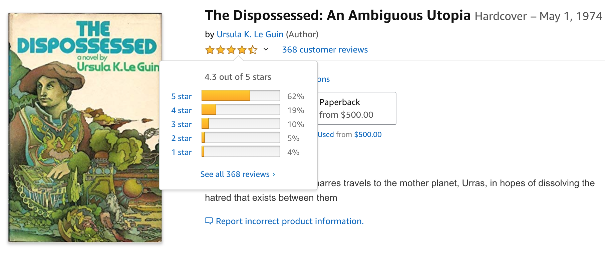
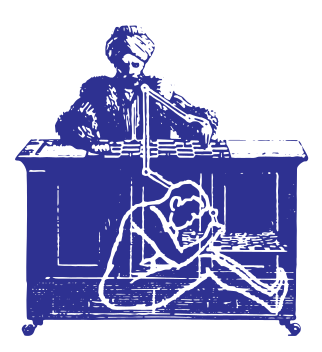
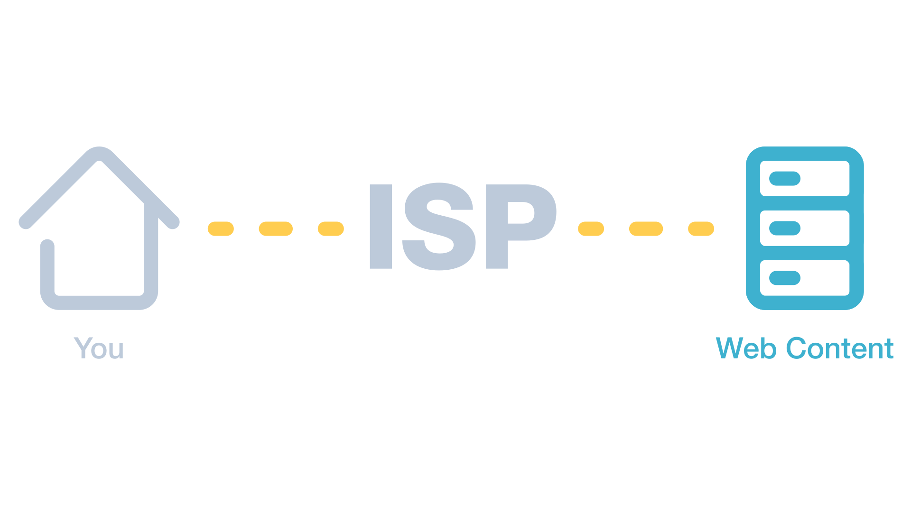
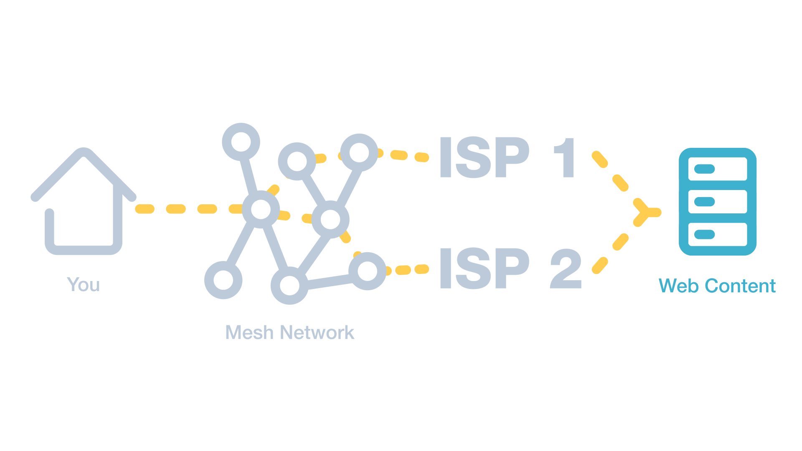
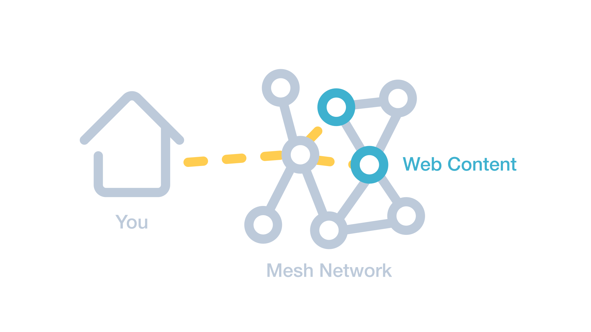

title: Building the Peer-to-Peer Internet
subtitle: and Our Platform Cooperatives
class: animation-fade
layout: true

<!-- This slide will serve as the base layout for all your slides -->
.bottom-bar[
  {{title}}
]

---

class: impact

.big[{{title}}]

{{subtitle}}

<br />

.soft[.small[Benedict + Communia // Radical Networks 2018]]

---

class: impact

Humans developed writing

then

_writing developed humans in new ways_

---

class: long bottom small

background-image: url(assets/the-sun.jpg)

*<i class="far fa-images"></i> https://de.wikipedia.org/wiki/Datei:Edvard_Munch_-_The_Sun_(1911).jpg*

---

class: dark-bg long contain bottom small

.background[
.center[
</img>
]
]

*<i class="far fa-images"></i> https://iconographic.warburg.sas.ac.uk/vpc/VPC_search/record.php?record=100268*

---

class: dark-bg long contain bottom small

.background[
.center[
<video width="90%" autoplay muted><source src="assets/galaxy.m4v" type="video/mp4"></video>
]
]

_<i class="far fa-images"></i> https://nasa.gov/content/hubble-highlights-tracing-the-growth-of-galaxies_

---

class: impact

A network of stars that take different forms

are

_multidimensional and dynamic_

---

# .soft[Amazon reviews]

</img>

.small[.small[_<i class="far fa-images"></i> https://www.amazon.com/Dispossessed-Ambiguous-Ursula-K-Guin/dp/0060125632/_]]

---

class: impact

_"Alexa, what can you do?"_

---

class: dark-bg

.col-8[
# .soft[The digital is material]

>As we see repeated throughout the system, contemporary forms of artificial intelligence are not so artificial after all. We can speak of the hard physical labor of mine workers, and the repetitive factory labor on the assembly line, of the cybernetic labor in distribution centers and the cognitive sweatshops full of outsourced programmers around the world, of the low paid crowdsourced labor of Mechanical Turk workers, or the unpaid immaterial work of users. .big[At every level contemporary technology is deeply rooted in and running on the exploitation of human bodies.]
]

.col-4[
<br />

</img>

<br />

.small[
.small[
_<i class="far fa-clone"></i> Crawford, K. & Joler, V., 2018_  
_<i class="far fa-images"></i> https://anatomyof.ai/#ai-ref-10-bottom_
]
]
]

---

class: dark-bg

# .soft[Our digital labour]

<i class="fas fa-ellipsis-v"></i> as a business model

- Amazon profiteering off of user-generated data

- How are values derived from our digital labours distributed?

<i class="fas fa-ellipsis-v"></i> as a human activity

- Do users generate content to our digital commons?

- Do users entrench Amazon's e-commerce dominance?

- Do users have autonomy to generate content to our digital commons?

---

class: dark-bg

# .soft[Autonomy & participative governance]

.big[
- White Book: participation, engagement, inclusion of the civil society on all levels of political decision process, including taking a specific decision and deploying it.

- Can mesh network communities propose a realistic alternative to State's governance over Internet?

- Can community organized networks overtake commercial ISP business model?
]

.small[.small[*<i class="far fa-clone"></i> http://ec.europa.eu/governance/white_paper/index_fr.htm*]]

---

class: impact

</img>

---

class: impact

</img>

---

class: impact

</img>

---

class: impact

In this workshop, we will set up a distributed content network

using the [InterPlanetary File System (IPFS)](https://ipfs.io) to exchange data

over a physical mesh network of Raspberry Pis

---

class: dark-bg

# </img> .soft[InterPlanetary File System]

## Content-addressing

<i class="fas fa-ellipsis-v"></i> referencing content by content hash

<br />

--

### Host-address
>https://.alt[youtu.be/].soft[0X95Nybu2g8]

--

### Content-address
>ipfs://.alt[QmcCXAbjDwnkhzL8qfrbJLH6DqEbrkBvaF8AiXsdXNLiDL]

---

class: dark-bg

## Downloading content from the IPFS network

1. Request ipfs://.alt[QmcCXAbjDwnkhzL8qfrbJLH6DqEbrkBvaF8AiXsdXNLiDL]

--

1. Ask peer .small[.soft[QmXLWSa1AbLJfivfT9dQJdvs6AsdMkjZjjBMv5SVtimVBq]] at:
    ```
    /ip6/fcb0:3f14:ebc8:1f7b:a1ce:bd44:a410:5049/tcp/4001
        /ipfs/QmXLWSa1AbLJfivfT9dQJdvs6AsdMkjZjjBMv5SVtimVBq
    ```
--
1. Fetch located content from .small[.soft[QmWhBDjaTRAdTi6rai18BwdWVfXRmzda544PcgT6DuBqP3]]:
  ```
  /ip4/122.147.156.131/tcp/48872
      /ipfs/QmWhBDjaTRAdTi6rai18BwdWVfXRmzda544PcgT6DuBqP3
  ```
--

1. Verify integrity of downloaded content with .alt[sha2-256] because  
`Q (0x12) -> sha2-256` which has a `m (0x20) -> 32` byte digest size

--

1. Cache content to scale up capacity making it more available on the IPFS network

---

class: dark-bg

# .soft[Peer-to-peer file sharing on a mesh]

Each Raspberry Pi:
- Has a unique name in the form of `<hostname>.local`
- Advertises a WiFi SSID `<hostname>` which you can connect with `password` as password
- Connects to other in-range Raspberry Pis via a second WiFi interface to form a mesh

We will use the [InterPlanetary File System (IPFS)](https://ipfs.io), a peer-to-peer hypermedia protocol, to share content with each other on our own network.

You can think of the Raspberry Pi as your home router and modem connecting to your Internet Service Provider (ISP), except now it has a direct line to other content-serving mesh nodes just like itself, and has superpowers because it runs like a full computer.